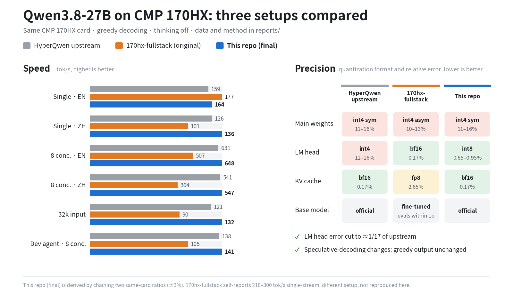

[中文](README.md) | English

# 170hx-qwen27b-inference-tuning

Inference tuning notes for Qwen3.8-27B on the NVIDIA CMP 170HX (GA100, sm_80, 64GB), with the full test methodology, patches, scripts and raw data. The starting point is [HyperQwen](https://github.com/syv-ai/HyperQwen) (vLLM + MTP speculative decoding). This round tried 10 directions: 3 shipped, 7 rejected.

## Results at a glance

- **Versus HyperQwen upstream** (MTP k=4, int4 LM head, same workload): Chinese single-stream +8.1%, 32k long input +9.0%; English single-stream +3.0%, 8-concurrent EN +2.7% / ZH +1.2% and dev-agent 8-concurrent +2.0% are all within the uncertainty of the derived numbers (about ±3%, ±5% for dev-agent) and count as flat. The speed budget has two parts: the combo build alone is 5–9% faster than the int8-head build (test card) and 6–12% faster in the same-window production A/B; the int8 LM head costs 0–4% speed (7% on 4k long input) in exchange for precision.
- **LM head int4 → int8**: the quantization error on the logits drops from 11–16% to 0.65–0.95%, about 1/17 of before; the main weights are unchanged. Top-1 agreement with the int4-head build is 97.63% (noise floor from self-comparison of one config: 99.45%), and every split is a near-tie with top-1 probability <0.6. The two speculative-decoding changes, vLLM 0.30 and the int4 draft head, keep greedy output equivalent to the baseline.
- **Versus the original 170hx-fullstack setup** (on this repo's workload and hardware): 8-concurrent EN +27.8% / ZH +50.2%, Chinese single-stream +34.7%, 32k long input +47.1%, dev-agent 8-concurrent +34.5%; English single-stream is 7.5% lower, where its DFlash2 drafter is faster on coding prompts.
- **Gateway session affinity**: replaying multi-turn dev sessions over two replicas, mean TTFT of follow-up turns falls to 1/6.5 (9.46 → 1.45 s) and 1/1.8 (4.37 → 2.45 s) of before, median session time −63% / −40%, with no change to outputs.
- **Distance from the original bf16 model**: not measured directly. In theory the main weights are still int4 g128 (11–16% error), and public experience puts W4 g128 at typically 0.5–1.5 points below bf16. This setup removes the extra int4 LM head error that upstream carries, keeps the KV cache in bf16, and speculative decoding does not change outputs.

> Basis: HyperQwen upstream and 170hx-fullstack were measured on the same card on 2026-09-24 ([reports/01](reports/01-three-way-comparison.md)); dev-agent 8-concurrent is a devbench replay from 2026-09-25, one pass per tier ([03](reports/03-dev-workload.md)). This repo's final setup is derived: upstream measurement × (int8 head / int4 head) ([02](reports/02-int8-lm-head.md), same card; dev-agent from [03](reports/03-dev-workload.md)) × (combo / baseline) ([04](reports/04-decode-six-items.md), same card). The two tests did not use the same card, so only same-card ratios are used; each ratio carries ±2% noise, so the chained result is uncertain by about ±3%. "HyperQwen upstream" means 684e927 + the `-fast` model with `SPEC=mtp`, `DRAFT_TOKENS=4`, `MTP_DRAFT_VOCAB=0`: the upstream default on sm80, `SPEC=dflash2`, triggers Xid 31, and with the default 40k draft vocabulary Chinese single-stream is only 68 tok/s ([01](reports/01-three-way-comparison.md) §4, [10](reports/10-dflash2-and-hybrid-research.md) §1). For reference, the community measurement in upstream [issue #98](https://github.com/syv-ai/HyperQwen/issues/98) on the same card is MTP k=4 EN code 177, prose 162 tok/s (8,484-token prompt, a different workload). The 218–300 tok/s single-stream figure self-reported in the 170hx-fullstack README could not be reproduced here; test conditions may differ. Precision figures come from the group=128 numeric simulation in [reports/09](reports/09-precision-theory.md) and the measurements in [02](reports/02-int8-lm-head.md).

**The full table of all variants is in [RESULTS.en.md](RESULTS.en.md)**; the methodology is in [reports/00](reports/00-methodology.md). The reports under `reports/` are in Chinese.

## Results by direction

### Shipped

| Item | Effect | Precision |
|---|---|---|
| **LM head int4 → int8** | 0–5% slower on regular load, 7% slower on 4k long input | Top-1 agreement with the int4 build 97.6% (method noise floor 99.45%); all splits fall on "fork tokens" with top-1 probability <~0.6 |
| **Combo: vLLM 0.30 + int4 draft head** | Same-window production A/B (vs the int8-head build): single-stream EN +12% / ZH +11%, 8-concurrent EN +8% / ZH +6% | Greedy output equivalent (gap at split points ≤0.25 nats on the baseline side) |
| **Gateway session affinity** (litellm session_affinity) | Follow-up-turn TTFT 9.46→1.45 s / 4.37→2.45 s; session time 100→37 s / 89→53 s | No effect |

Session affinity recognizes three kinds of session id, all verified in testing: `x-litellm-session-id`; `x-*-session-id` (the value must look like a UUID, at least 8 characters, e.g. Claude Code's built-in `x-claude-code-session-id`); and `metadata.user_id` in Anthropic requests. Both the OpenAI and Anthropic APIs were verified; see [reports/07](reports/07-session-affinity-routing.md).

The combo build soaked on a canary for 80 minutes: 319 requests, 0 errors, 0 Xid. It was rolled out to all 7 replicas on 2026-09-25.

### Rejected

| Option | Result | Reason |
|---|---|---|
| [170hx-fullstack](https://github.com/ChinaBoy0618/170hx-qwen3.8-27b-fullstack) (SGLang + DFlash2 + EfficientThink) | On this repo's workload and hardware: general 8-concurrent throughput 19–33% lower, dev-agent 8-concurrent 15–24% lower; English single-stream 11–18% higher | On this workload the DFlash2 drafter's Chinese acceptance rate is about 23% |
| Truncated draft vocabulary 32k / 48k / 64k | 3–17% slower | Coverage gaps cut acceptance length by 0.1–0.4 |
| KV fp8 | 25–59% slower | sm80 can only use FlashInfer, and CUDA graphs degrade under spec decode; precision below the noise floor |
| KV int8 | 53–59% slower on dev-agent load | Triton prefill is too slow |
| cpuset / nice | ±1% | The bottleneck is the GPU power cap |
| MTP + suffix hybrid (K=4) | Dev-agent single session 12% slower | 4-gram false matches in long contexts; one D2H wait per step |
| DFlash2 on vLLM sm80 | Xid 31 | Not fixed upstream; see links below |

> About 170hx-fullstack: it is a complete setup tuned for its own deployment (including a gateway, tiered caching, etc.). Only inference throughput on this repo's hardware and workload is compared here, with its hicache, L3 cache and prefix warm-up turned off. The 218–300 tok/s self-reported in its README could not be reproduced in this environment (test conditions may differ); see [reports/01](reports/01-three-way-comparison.md).

### Key findings
- **The bottleneck is power.** Under full load the card sits at the 250W power cap more than 95% of the time, with a median SM clock of 1350MHz (max 1695MHz).
- **Do not run TP across cards.** With PCIe Gen2 and no P2P, TP=2 is 6–9× slower than a single card.
- **Speculative decoding does not change the output distribution** (under both greedy and rejection sampling). The measured splits only occur at near-ties within bf16 resolution.
- **Draft vocabulary depends on language.** The upstream 40k draft vocabulary covers only about 36% of Chinese; after switching to full-vocabulary drafting, Chinese single-stream went from 68 to 127 tok/s.

## Hardware and software

| | |
|---|---|
| GPU | Multiple CMP 170HX, PCIe Gen2 x4, no P2P, 250W power cap |
| VRAM prerequisite | 64GB of VRAM requires the community [cmpunlocker](https://github.com/buliaoyin/cmpunlocker) unlocked driver (otherwise only 8GB). **Re-patch after every driver upgrade**, or after a reboot the card falls back to 8GB and PCIe drops to Gen1 |
| Deployment | One independent replica per card, 7 replicas in total across 2 nodes, behind a litellm gateway |
| Model | Qwen3.8-27B W4A16 AutoRound (int4 g128 symmetric, Marlin), MTP head |
| Baseline | HyperQwen 684e927 (vLLM 0.28), MTP k=4, full-vocabulary drafting, KV bf16 |
| Final | vLLM 0.30 (self-built from [HyperQwen PR#189](https://github.com/syv-ai/HyperQwen/pull/189)), int8 LM head + int4 draft head, KV bf16, gateway session affinity |

## Method
- **General workload** ([`bench/abbench.py`](bench/abbench.py)): 8 prompts each in Chinese and English, c1 / c4 / c8, plus 4k and 32k long inputs. Greedy, thinking off, max_tokens=900, median of 2 rounds.
- **Dev-agent workload** ([`bench/devbench.py`](bench/devbench.py)): a ~23K-token Claude Code prefix, 8 multi-turn agent sessions with 35 turns in total, including tool calls and tool results. Replayed at session concurrency c1 / c4 / c8.
- **Correctness**:
  - gate: 17 greedy outputs compared token by token;
  - probe: at a split point, re-select via the prefill path to decide whether it is a tie;
  - tf: teacher forcing, counting top-1 agreement.
- **Noise band**: the same config is measured once at the start and once at the end; the difference is the noise band. General load ±2%, dev-agent single session ±0.5%, concurrent aggregate ±5%.
- **Rollout process**: dedicated test card → single-replica canary soak → same-window production A/B → rolling rollout (per-replica self-check, stop on failure).

An external power outage occurred during testing; the affected rounds were re-run in full.

## Reports

The reports are in Chinese.

| # | Contents |
|---|---|
| [RESULTS](RESULTS.en.md) | Table of all variants: one row per variant, with changes in single-stream, concurrency, long context, dev-agent load, and precision ([Chinese version](RESULTS.md)) |
| [00](reports/00-methodology.md) | Methodology: baselines, workloads, noise band, correctness gates, GPU sampling |
| [01](reports/01-three-way-comparison.md) | Production HyperQwen vs 170hx-fullstack: all tiers, acceptance rates, code-prompt split, theoretical precision |
| [02](reports/02-int8-lm-head.md) | LM head int4 → int8: full table, per-prompt splits, tf, rollout steps |
| [03](reports/03-dev-workload.md) | Dev-agent workload: design, four-config full table, tool-call correctness, root cause of 400 errors |
| [04](reports/04-decode-six-items.md) | Decode speedups: int4 draft head, draft vocabulary, vLLM 0.29 / 0.30, cpuset / nice, combo build |
| [05](reports/05-mtp-suffix-hybrid.md) | MTP + suffix hybrid (rejected): full table, split by turn type, sync overhead |
| [06](reports/06-canary-and-rollout.md) | Combo canary, per-round production A/B data, rolling rollout and rollback |
| [07](reports/07-session-affinity-routing.md) | Gateway session affinity: two-round comparison, 7-replica projection, config and post-rollout measurements |
| [08](reports/08-kv-cache-quantization.md) | KV cache quantization int8 / fp8 (rejected): full table, capacity, precision, causes |
| [09](reports/09-precision-theory.md) | Theoretical precision estimates and measured validation |
| [10](reports/10-dflash2-and-hybrid-research.md) | Research: DFlash2 Xid 31, DFlash2 vs MTP estimates, existing hybrid-drafting implementations, draft-vocabulary ceiling |

Raw data is in [`reports/data/`](reports/data/): per-round tables (each round's values and the median, acceptance length and rate), per-session data, GPU sampling, and the verbatim output of the summary scripts at the time; the index is in [reports/00](reports/00-methodology.md) §9.

## Charts

| Speed comparison | Precision comparison | Dev-agent workload |
|---|---|---|
|  |  |  |

These charts are in Chinese; only the hero chart ([`charts/hero-en.png`](charts/hero-en.png)) has an English version. The three comparison charts above were made on 2026-09-24 ~ 25, and the "production" label in them means the int4-LM-head build of that time, not the final configuration. The hero chart is generated by `charts/chart_hero.py`. All charts are generated by `charts/*.py` (requires matplotlib and the Noto Sans CJK font), e.g. `python3 charts/chart_summary.py`.

## How to reproduce
1. Unlock 64GB of VRAM with [cmpunlocker](https://github.com/buliaoyin/cmpunlocker) (re-patch after every driver upgrade).
2. Prepare the image and model following [HyperQwen](https://github.com/syv-ai/HyperQwen); on sm80 set `SPEC=mtp`, `MTP_DRAFT_VOCAB=0`, `DRAFT_TOKENS=4`.
3. **int8 LM head**: generate the D2 directory with [`patches/d3-draft-head4/mk_variants.py`](patches/d3-draft-head4/mk_variants.py) (production uses [`patches/head8-prod/mk-head8-prod.sh`](patches/head8-prod/mk-head8-prod.sh)).
4. **Combo build**: build a vLLM 0.30 image yourself (vllm 0.30.0 + the PR#189 patch series); assemble the `-fast-head8-d3` directory per [`patches/README.md`](patches/README.md) (relative symlinks required), apply [`qwen3_5_mtp.v030.diff`](patches/d3-draft-head4/qwen3_5_mtp.v030.diff), and start with [`deploy/run-replica-c1.sh`](deploy/run-replica-c1.sh).
5. **Gateway**: merge [`deploy/litellm/session-affinity.snippet.yaml`](deploy/litellm/session-affinity.snippet.yaml) into the litellm config.
6. **Benchmarking**: see [`bench/README.md`](bench/README.md). For every change, measure the baseline noise band first, then compare.

## Related upstream links
- HyperQwen: [repo](https://github.com/syv-ai/HyperQwen) · [PR#189 vLLM 0.30 port](https://github.com/syv-ai/HyperQwen/pull/189) · [#98 dflash2 triggers Xid 31 on sm80](https://github.com/syv-ai/HyperQwen/issues/98) · [#72 DFlash2 cumulative out-of-bounds on 170HX](https://github.com/syv-ai/HyperQwen/issues/72)
- vLLM: [#56736 Xid 31 with hybrid Mamba/GDN + speculative decoding](https://github.com/vllm-project/vllm/issues/56736) · [#55279 DFlash2 cumulative out-of-bounds](https://github.com/vllm-project/vllm/issues/55279) · [#56148 Triton split-K for spec decode verification](https://github.com/vllm-project/vllm/pull/56148)
- [wtdcode/vllm-backport PR#82](https://github.com/wtdcode/vllm-backport/pull/82): split-KV kernel for spec decode verification on sm8x, with a KV gather bounds-mask fix (currently the only Xid 31 fix with measured validation)
- [ArcticInference](https://github.com/snowflakedb/ArcticInference): suffix decoding
- [170hx-qwen3.8-27b-fullstack](https://github.com/ChinaBoy0618/170hx-qwen3.8-27b-fullstack): the compared setup
- [cmpunlocker](https://github.com/buliaoyin/cmpunlocker): 64GB VRAM unlock driver for the CMP 170HX

## License
Scripts, reports and charts are MIT (see [LICENSE](LICENSE)). The `.diff` files under `patches/` modify Apache-2.0 projects and are distributed under Apache-2.0 (see [NOTICE](NOTICE)).
