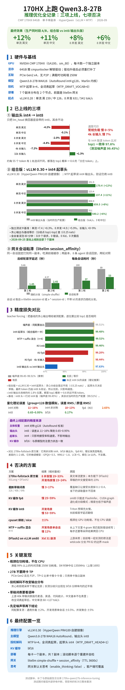
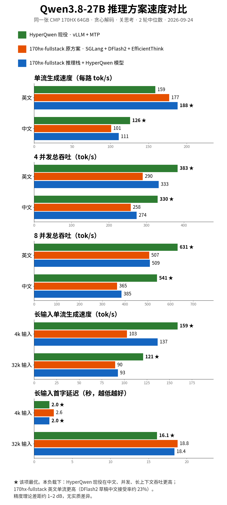
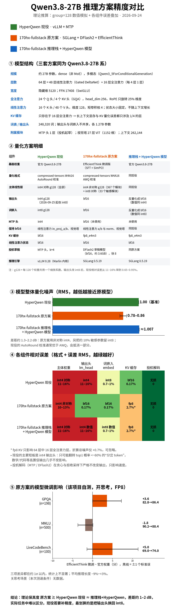
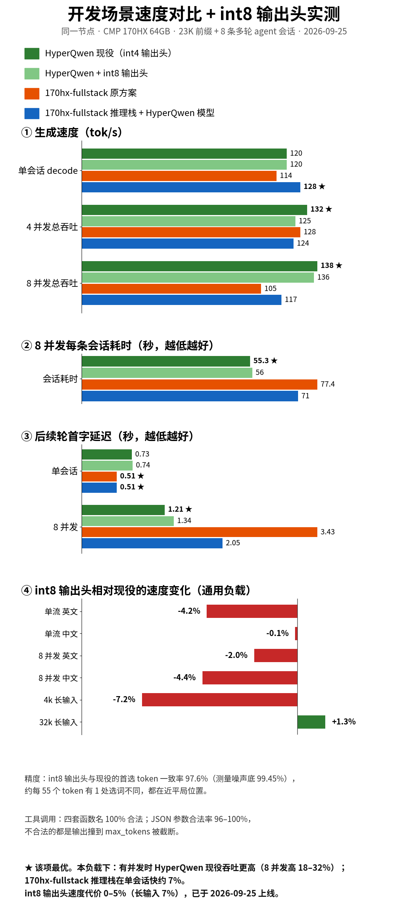

# 170hx-qwen27b-inference-tuning

在 NVIDIA CMP 170HX（GA100，sm_80，64GB）上跑 Qwen3.8-27B 的推理优化记录，包括完整的测试方法、补丁、脚本和原始数据。起点是 [HyperQwen](https://github.com/syv-ai/HyperQwen)（vLLM + MTP 投机解码）。这一轮试了 10 个方向：上线 3 项，否决 7 项。

**全部变体的数据总表见 [RESULTS.md](RESULTS.md)**，测试方法见 [reports/00](reports/00-methodology.md)。

## 成果摘要

### 已上线

| 项 | 效果 | 精度 |
|---|---|---|
| **输出头 int4 → int8** | 常规负载慢 0–5%，4k 长输入慢 7% | 与 int4 版的 top1 一致率 97.6%（测法噪声底 99.45%），分歧都落在 top1 概率 <~0.6 的「分岔 token」上 |
| **组合版：vLLM 0.30 + int4 起草头** | 生产同时段 A/B：单流 英 +12% / 中 +11%，8 并发 英 +8% / 中 +6% | 贪心输出等价（分歧处差值基线侧 ≤0.25 nats） |
| **网关会话粘滞**（litellm session_affinity） | 后续轮 TTFT 9.46→1.45 s / 4.37→2.45 s；会话耗时 100→37 s / 89→53 s | 无影响 |

会话粘滞识别三种会话 id，均已实测生效：`x-litellm-session-id`；`x-*-session-id`（值要像 UUID、至少 8 位，如 Claude Code 自带的 `x-claude-code-session-id`）；Anthropic 请求的 `metadata.user_id`。OpenAI 与 Anthropic 两种接口都已实测生效，详见 [reports/07](reports/07-session-affinity-routing.md)。

组合版的金丝雀浸泡 80 分钟，319 个请求，0 错误、0 Xid。2026-09-25 已滚动上线到全部 7 个副本。

### 否决

| 方案 | 结果 | 原因 |
|---|---|---|
| [170hx-fullstack](https://github.com/ChinaBoy0618/170hx-qwen3.8-27b-fullstack)（SGLang + DFlash2 + EfficientThink） | 在本仓库的负载与硬件下：通用 8 并发吞吐低 19–33%，开发场景 8 并发低 15–24%；英文单流高 11–18% | 本负载下 DFlash2 草稿的中文接受率约 23% |
| 截断草稿词表 32k / 48k / 64k | 慢 3–17% | 覆盖缺口让接受长度下降 0.1–0.4 |
| KV fp8 | 慢 25–59% | sm80 只能走 FlashInfer，spec decode 下 CUDA graph 退化；精度低于噪声底 |
| KV int8 | 开发场景慢 53–59% | Triton 预填充太慢 |
| cpuset / nice | ±1% | 瓶颈在 GPU 功耗墙 |
| MTP + suffix 混合（K=4） | 开发场景单会话慢 12% | 长上下文里 4-gram 误匹配；每步要等一次 D2H |
| DFlash2 on vLLM sm80 | Xid 31 | 上游未修，见下方链接 |

> 关于 170hx-fullstack：它是一套面向自身部署调优的完整方案（含网关、分层缓存等）。这里只比较在本仓库硬件与负载下的推理吞吐，测试时关闭了其 hicache、L3 缓存与前缀预热。其 README 自报的 218–300 tok/s 在本环境未能复现（测试条件可能不同），详见 [reports/01](reports/01-three-way-comparison.md)。

### 关键发现
- **瓶颈在功耗。** 满载时 95% 以上的时间顶着 250W 功耗墙，SM 时钟中位 1350MHz（上限 1695MHz）。
- **不要跨卡做 TP。** PCIe Gen2 且没有 P2P，TP=2 比单卡慢 6–9 倍。
- **投机解码不改变输出分布**（贪心和拒绝采样下都是如此）。实测的分歧只出现在 bf16 分辨率以内的近平局。
- **草稿词表要看语种。** 上游 40k 草稿词表对中文的覆盖只有约 36%，改成全词表起草后，中文单流从 68 升到 127 tok/s。

## 硬件与软件

| | |
|---|---|
| GPU | CMP 170HX × 多张，PCIe Gen2 x4，无 P2P，功耗墙 250W |
| 显存前提 | 64GB 显存需要社区的 [cmpunlocker](https://github.com/buliaoyin/cmpunlocker) 解锁驱动（否则只有 8GB）。**驱动升级后必须重新打补丁**，否则重启后会掉回 8GB 且 PCIe 降到 Gen1 |
| 部署 | 每卡一个独立副本，共 7 个副本，分布在 2 个节点；前面是 litellm 网关 |
| 模型 | Qwen3.8-27B W4A16 AutoRound（int4 g128 对称，Marlin），MTP 头 |
| 基线 | HyperQwen 684e927（vLLM 0.28）、MTP k=4、全词表起草、KV bf16 |
| 最终 | vLLM 0.30（[HyperQwen PR#189](https://github.com/syv-ai/HyperQwen/pull/189) 自建）、int8 输出头 + int4 起草头、KV bf16、网关会话粘滞 |

## 方法
- **通用负载**（[`bench/abbench.py`](bench/abbench.py)）：中英各 8 条，c1 / c4 / c8，外加 4k 和 32k 长输入。贪心、关思考、max_tokens=900，2 轮取中位数。
- **开发场景**（[`bench/devbench.py`](bench/devbench.py)）：约 23K token 的 Claude Code 前缀，8 条多轮 agent 会话共 35 轮，含工具调用和结果回填。按会话并发 c1 / c4 / c8 回放。
- **正确性**：
  - gate：17 条贪心输出，逐 token 比对；
  - probe：在分歧点用 prefill 路径重选，判断是否为平局；
  - tf：teacher forcing，统计 top1 一致率。
- **噪声带**：开场和收尾各测一次同一配置，差值定为噪声带。通用负载 ±2%，开发场景单会话 ±0.5%，并发聚合 ±5%。
- **上线流程**：独立测试卡 → 单副本金丝雀浸泡 → 同时段生产 A/B → 滚动上线（逐个副本自检，失败即停）。

测试期间曾因外部供电中断，受影响的轮次已整体重测。

## 报告

| # | 内容 |
|---|---|
| [RESULTS](RESULTS.md) | 全部变体总表：每行一个变体，列出单流、并发、长上下文、开发场景的变化与精度 |
| [00](reports/00-methodology.md) | 测试方法：基线、负载、噪声带、正确性硬门、GPU 采样 |
| [01](reports/01-three-way-comparison.md) | 现役 HyperQwen vs 170hx-fullstack：全部档位、接受率、代码题拆分、理论精度 |
| [02](reports/02-int8-lm-head.md) | 输出头 int4 → int8：全表、逐条分歧、tf、上线步骤 |
| [03](reports/03-dev-workload.md) | 开发场景负载：设计、四套配置全表、工具调用正确率、400 报错根因 |
| [04](reports/04-decode-six-items.md) | decode 提速各项：int4 起草头、草稿词表、vLLM 0.29 / 0.30、cpuset / nice、组合版 |
| [05](reports/05-mtp-suffix-hybrid.md) | MTP + suffix 混合（否决）：全表、按轮次类型拆分、同步开销 |
| [06](reports/06-canary-and-rollout.md) | 组合版金丝雀、生产 A/B 逐轮数据、滚动上线与回滚 |
| [07](reports/07-session-affinity-routing.md) | 网关会话粘滞：两轮对照、7 副本推算、配置与上线后实测 |
| [08](reports/08-kv-cache-quantization.md) | KV cache 量化 int8 / fp8（否决）：全表、容量、精度、原因 |
| [09](reports/09-precision-theory.md) | 理论精度推算与实测验证 |
| [10](reports/10-dflash2-and-hybrid-research.md) | 调研：DFlash2 Xid 31、DFlash2 vs MTP 推算、混合起草现有实现、草稿词表上限 |

原始数据在 [`reports/data/`](reports/data/)：各轮逐轮表（两轮各自的数值与中位、接受长度与接受率）、逐会话数据、GPU 采样，以及当时汇总脚本的原样输出，索引见 [reports/00](reports/00-methodology.md) §9。

## 图表

| 速度对比 | 精度对比 | 开发场景 |
|---|---|---|
|  |  |  |

前三张图做于 2026-09-24 ~ 25，图中的「现役」指当时的 int4 输出头版，不是最终配置。图由 `charts/*.py` 生成（需要 matplotlib 和 Noto Sans CJK 字体）：`python3 charts/chart_summary.py`。

## 如何复现
1. 按 [cmpunlocker](https://github.com/buliaoyin/cmpunlocker) 解锁 64GB 显存（驱动每次升级后都要重打）。
2. 按 [HyperQwen](https://github.com/syv-ai/HyperQwen) 的说明准备镜像和模型，在 sm80 上设 `SPEC=mtp`、`MTP_DRAFT_VOCAB=0`、`DRAFT_TOKENS=4`。
3. **int8 输出头**：用 [`patches/d3-draft-head4/mk_variants.py`](patches/d3-draft-head4/mk_variants.py) 生成 D2 目录（生产上用 [`patches/head8-prod/mk-head8-prod.sh`](patches/head8-prod/mk-head8-prod.sh)）。
4. **组合版**：自建 vLLM 0.30 镜像（vllm 0.30.0 + PR#189 补丁系列）；按 [`patches/README.md`](patches/README.md) 组装 `-fast-head8-d3` 目录（要求用相对链接），再打 [`qwen3_5_mtp.v030.diff`](patches/d3-draft-head4/qwen3_5_mtp.v030.diff)，用 [`deploy/run-replica-c1.sh`](deploy/run-replica-c1.sh) 启动。
5. **网关**：把 [`deploy/litellm/session-affinity.snippet.yaml`](deploy/litellm/session-affinity.snippet.yaml) 并入 litellm 配置。
6. **测速**：见 [`bench/README.md`](bench/README.md)。每次改动都先测基线的噪声带，再做比较。

## 相关上游链接
- HyperQwen：[仓库](https://github.com/syv-ai/HyperQwen) · [PR#189 vLLM 0.30 移植](https://github.com/syv-ai/HyperQwen/pull/189) · [#98 sm80 上 dflash2 触发 Xid 31](https://github.com/syv-ai/HyperQwen/issues/98) · [#72 DFlash2 在 170HX 上的累积越界](https://github.com/syv-ai/HyperQwen/issues/72)
- vLLM：[#56736 hybrid Mamba/GDN + 投机解码的 Xid 31](https://github.com/vllm-project/vllm/issues/56736) · [#55279 DFlash2 累积越界](https://github.com/vllm-project/vllm/issues/55279) · [#56148 spec decode 验证的 Triton split-K](https://github.com/vllm-project/vllm/pull/56148)
- [wtdcode/vllm-backport PR#82](https://github.com/wtdcode/vllm-backport/pull/82)：sm8x 上 spec decode 验证的 split-KV 内核，附带 KV gather 边界 mask 修复（目前唯一有实测验证的 Xid 31 修法）
- [ArcticInference](https://github.com/snowflakedb/ArcticInference)：suffix decoding
- [170hx-qwen3.8-27b-fullstack](https://github.com/ChinaBoy0618/170hx-qwen3.8-27b-fullstack)：对比方案
- [cmpunlocker](https://github.com/buliaoyin/cmpunlocker)：CMP 170HX 64GB 显存解锁驱动

## 许可证
脚本、报告、图表用 MIT（见 [LICENSE](LICENSE)）。`patches/` 下的 `.diff` 是对 Apache-2.0 项目的修改，按 Apache-2.0 分发（见 [NOTICE](NOTICE)）。
